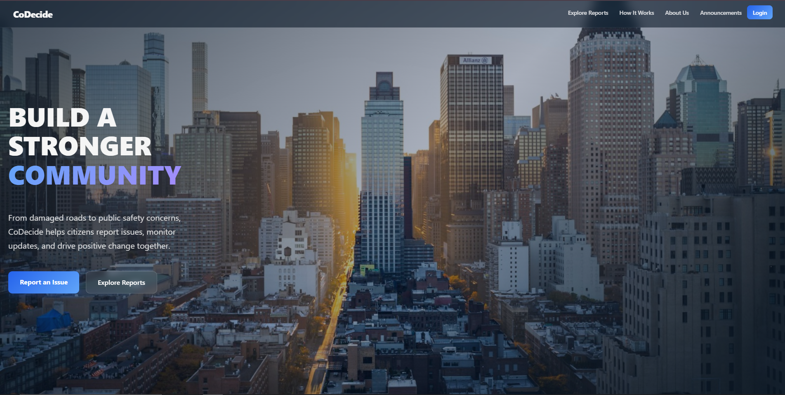

<h1 align="center">CoDecide</h1>

<p align="center">
  <a href="https://git-scm.com/"></a>
  <a href="https://www.conventionalcommits.org/"></a>
</p>

---

<p align="center">
  
</p>

<p align="center">
  Portal comunitario para reportar y dar seguimiento a problemas del vecindario<br>
  — desde problemas de infraestructura hasta conflictos de convivencia.
</p>

---

## Tabla de Contenido

- [Tecnologías y otros](#tecnologías-y-otros)
- [Categorías del Proyecto](#categorías-del-proyecto)
- [Estructura](#estructura)
- [Inicio Rápido](#inicio-rápido)
- [Equipo](#equipo)
- [Documentación](#documentación)
- [Contribuir](#contribuir)

---

<div align="center">

## Tecnologías y otros

### Build & Tooling

<p>
  <a href="https://vite.dev/"></a>
  <a href="https://git-scm.com/"></a>
</p>

### Frontend

<p>
  <a href="https://developer.mozilla.org/en-US/docs/Web/JavaScript/Guide/Modules"></a>
  <a href="https://tailwindcss.com/"></a>
  <a href=""></a>
</p>

### Backend

<p>
  <a href="https://www.python.org/"></a>
  <a href="https://flask.palletsprojects.com/"></a>
  <a href="https://www.mysql.com/"></a>
  <a href="https://www.mongodb.com/"></a>
  <a href=""></a>
</p>

</div>

---

## Categorías del Proyecto

- **Inclusión Social** — empoderar a los residentes para participar en decisiones comunitarias
- **Productividad** — optimizar el reporte y gestión de incidentes
- **Cultura** — fomentar la convivencia transparente y el compromiso cívico

## Estructura

```
CoDecide/
├── apps/
│   ├── frontend/       # Vite + Vanilla JS SPA
│   └── backend/        # Flask REST API (MySQL + MongoDB)
├── docs/
│   ├── CONTRIBUTING.md      # Estrategia de ramas, convención de commits, flujo PR (EN)
│   ├── CONTRIBUTING.es.md   # Mismo contenido en español
│   ├── get-started/         # Guías de inicio rápido (EN/ES)
│   ├── frontend/            # Documentación de arquitectura frontend (EN/ES)
│   ├── backend/             # Documentación de arquitectura backend (EN/ES)
│   └── bug-report/          # Plantillas y guía de issues de bug (EN/ES)
├── LICENSE
├── .gitignore
├── README.md
└── README.es.md
```

## Inicio Rápido

Consulta la guía de [Primeros Pasos](/docs/get-started/ES.md) para instrucciones detalladas de configuración para Windows y Linux.

- **[Primeros Pasos (Español)](/docs/get-started/ES.md)**
- **[Get Started (English)](/docs/get-started/EN.md)**

## Equipo

### Backend

| Nombre | Clan | GitHub |
|--------|------|--------|
| Brandon Carranza | Garabato | [nastex123](https://github.com/nastex123) |
| Camilo Gale | Garabato | [JuanGale-20](https://github.com/JuanGale-20) |

### Frontend

| Nombre | Clan | GitHub |
|--------|------|--------|
| Carlos Muñoz | Micaela | [Carmuand](https://github.com/Carmuand) |
| Maria Muñoz | Micaela | [AngelusMunoz](https://github.com/AngelusMunoz) |

### QA, Test & DBA

| Nombre | Clan | GitHub |
|--------|------|--------|
| Andrea Bernal | Cayena | [Andrea2112Jotanicia](https://github.com/Andrea2112Jotanicia) |

### Scrum Master

| Nombre | Clan | GitHub |
|--------|------|--------|
| Gustavo Guzmán | Micaela | [Zerik-Official](https://github.com/Zerik-Official) |

## Documentación

| Idioma | Primeros Pasos | Frontend | Backend |
|--------|----------------|----------|---------|
| Inglés | [Guide](docs/get-started/EN.md) | [Architecture](docs/frontend/EN/) | [Architecture](docs/backend/EN/) |
| Español | [Guía](docs/get-started/ES.md) | [Arquitectura](docs/frontend/ES/) | [Arquitectura](docs/backend/ES/) |

## Contribuir

Ver [CONTRIBUTING.md](docs/CONTRIBUTING.md) para la estrategia de ramas, convención de commits y flujo de PR.

Ver la [Guía de Issues de Bug](docs/bug-report/README.md) para cómo crear y formatear reportes de bug.
